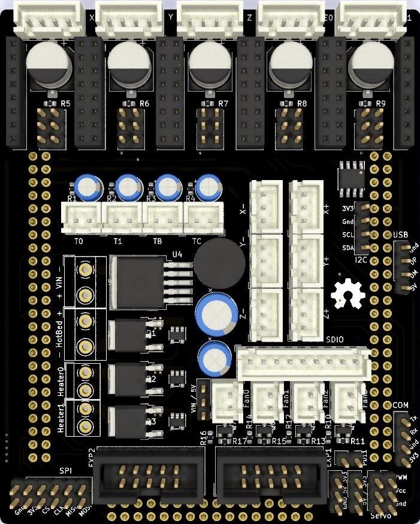

# RAMPS-like shield for [black STM32F407VET6](https://wiki.stm32duino.com/index.php?title=STM32F407) board

__Work-in-progress. Use with caution!__

First public release.
Corrected version of prototype board.

Changelog:
 - Updated pins names on 2x24 connectors and removed 3V3 to GND wire
 - Fixed broken E1_enable wire
 - Added missing wire between CLK pins in SPI connector
